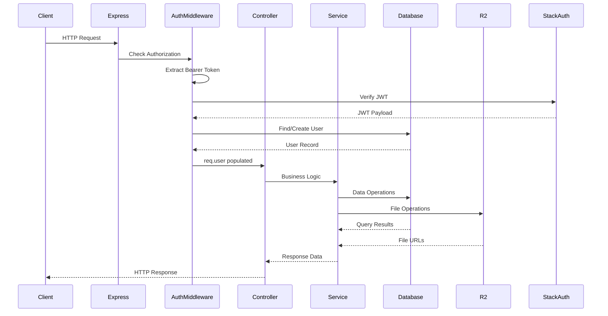

# FiLot Backend Audit Documentation

**Version:** 1.0.0  
**Date:** November 26, 2025  
**Auditor:** Replit Agent  
**Status:** Complete

---

## Table of Contents

1. [Executive Overview](#section-1--executive-overview)
2. [Full Architecture Diagram](#section-2--full-architecture-diagram)
3. [Server Structure](#section-3--server-structure)
4. [Environment Variables](#section-4--environment-variables)
5. [Database Schema (Neon)](#section-5--database-schema-neon)
6. [API Endpoints (Comprehensive)](#section-6--api-endpoints-comprehensive)
7. [Cloudflare R2 Integration Audit](#section-7--cloudflare-r2-integration-audit)
8. [OCR Pipeline Audit](#section-8--ocr-pipeline-audit)
9. [Hybrid Verification (Tranche 6)](#section-9--hybrid-verification-tranche-6)
10. [Security Audit](#section-10--security-audit)
11. [Temporal Readiness (Future)](#section-11--temporal-readiness-future)
12. [Known Issues & Recommendations](#section-12--known-issues--recommendations)
13. [Final Summary](#section-13--final-summary)

---

## SECTION 1 — Executive Overview

### Purpose of FiLot Backend

FiLot (Financial Lot) is a financial AI assistant backend designed to facilitate user identity verification through Indonesian identity documents (KTP - Kartu Tanda Penduduk and NPWP - Nomor Pokok Wajib Pajak). The system provides:

- **User Authentication** via Stack Auth integration
- **Document Upload** with Cloudflare R2 storage
- **OCR Processing** using Tesseract for Indonesian documents
- **AI-Powered Scoring** for automatic document verification
- **Hybrid Verification** combining AI with human review through Buli2 integration
- **Temporal-Ready Architecture** for future workflow orchestration

### High-Level Architecture

```
┌─────────────────┐     ┌─────────────────────────────────────────────┐
│   Frontend      │────▶│              FiLot Backend                  │
│   (React/Web)   │     │                                             │
└─────────────────┘     │  ┌─────────────────────────────────────┐   │
                        │  │          Express.js API              │   │
                        │  │  ┌─────────┬─────────┬─────────┐    │   │
                        │  │  │  Auth   │ Docs    │  OCR    │    │   │
                        │  │  │ Routes  │ Routes  │ Process │    │   │
                        │  │  └─────────┴─────────┴─────────┘    │   │
                        │  └─────────────────────────────────────┘   │
                        │                    │                        │
                        │  ┌─────────────────▼─────────────────────┐ │
                        │  │           Services Layer               │ │
                        │  │  ┌────────┬────────┬────────────────┐ │ │
                        │  │  │  R2    │  AI    │   Forward to   │ │ │
                        │  │  │Storage │Scoring │     Buli2      │ │ │
                        │  │  └────────┴────────┴────────────────┘ │ │
                        │  └───────────────────────────────────────┘ │
                        └─────────────────────────────────────────────┘
                                         │
        ┌────────────────────────────────┼────────────────────────────┐
        ▼                                ▼                            ▼
┌───────────────┐              ┌─────────────────┐          ┌─────────────────┐
│  Neon/Postgres│              │  Cloudflare R2  │          │     Buli2       │
│   Database    │              │  Object Storage │          │ (Manual Review) │
└───────────────┘              └─────────────────┘          └─────────────────┘
```

### Backend → Frontend Responsibilities

| Component | Backend Responsibility | Frontend Responsibility |
|-----------|----------------------|------------------------|
| **Authentication** | JWT verification via Stack Auth, user creation/lookup | Token management, login UI, session handling |
| **Document Upload** | Validation, R2 storage, DB record creation | File selection, upload progress, preview |
| **OCR Processing** | Queue management, Tesseract execution, parsing | Processing status polling, result display |
| **Verification** | AI scoring, decision routing, Buli2 integration | Status tracking, result visualization |
| **Profile** | CRUD operations, data validation | Form handling, display |

### Buli2 Integration Vision

Buli2 serves as the **human-in-the-loop verification system** for documents that cannot be automatically approved or rejected. The integration follows a callback-based architecture:

1. FiLot sends documents requiring manual review to Buli2
2. Buli2 queues the review task for human reviewers
3. Upon decision, Buli2 calls back to FiLot's internal endpoint
4. FiLot updates document and user verification status

### Hybrid Verification Flow Summary

**Important:** The verification flow has two distinct stages:

1. **OCR Processing Stage** (automatic after POST /documents/:id/process)
   - Runs OCR → Parses data → Computes initial AI score
   - Only two outcomes: `auto_approved` (score ≥ 75) or `pending_manual_review`
   - If pending, automatically escalates to Buli2

2. **Evaluation Stage** (explicit call to POST /verification/evaluate)
   - Can be called on completed documents for re-evaluation
   - Three possible decisions: `auto_approve`, `needs_review`, `auto_reject`
   - Uses configurable thresholds (85 approve, 35 reject)

```
┌─────────────────────────────────────────────────────────────────────┐
│                    STAGE 1: OCR PROCESSING                          │
│                 (POST /documents/:id/process)                       │
└─────────────────────────────────────────────────────────────────────┘

Document Upload → OCR Processing → Initial AI Score
                                         │
                    ┌────────────────────┴────────────────────┐
                    ▼                                         ▼
              Score ≥ 75                                Score < 75
                    │                                         │
              AUTO_APPROVED                      PENDING_MANUAL_REVIEW
                    │                                         │
                    │                            Escalate to Buli2
                    │                                         │
                    ▼                                         ▼
               COMPLETE                             Await Human Decision

┌─────────────────────────────────────────────────────────────────────┐
│                    STAGE 2: EXPLICIT EVALUATION                     │
│                   (POST /verification/evaluate)                     │
└─────────────────────────────────────────────────────────────────────┘

Completed Document → AI Re-Scoring (configurable thresholds)
                            │
         ┌──────────────────┼──────────────────┐
         ▼                  ▼                  ▼
    Score ≥ 85        35 < Score < 85    Score ≤ 35
         │                  │                  │
    AUTO_APPROVE       NEEDS_REVIEW       AUTO_REJECT
         │                  │                  │
         │           Forward to Buli2          │
         ▼                  ▼                  ▼
      APPROVED         Human Review        REJECTED
```

---

## SECTION 2 — Full Architecture Diagram

### Backend Request Lifecycle



### Authentication Flow

```
┌──────────────────────────────────────────────────────────────────┐
│                      Stack Auth Authentication                    │
└──────────────────────────────────────────────────────────────────┘
                              │
            ┌─────────────────┼─────────────────┐
            ▼                                   ▼
    [Token Verification]               [Token Refresh]
            │                                   │
     POST /auth/verify                  POST /auth/refresh
            │                                   │
    ┌───────▼───────┐               ┌───────────▼───────────┐
    │ Verify with   │               │ Refresh via Stack     │
    │ Stack JWKS    │               │ Auth API              │
    └───────┬───────┘               └───────────┬───────────┘
            │                                   │
    ┌───────▼───────┐               ┌───────────▼───────────┐
    │ Find/Create   │               │ Return new access     │
    │ User in DB    │               │ token to client       │
    └───────┬───────┘               └───────────────────────┘
            │
    ┌───────▼───────┐
    │ Return User   │
    │ Profile       │
    └───────────────┘
```

### Document Upload R2 Flow

```
┌─────────────────────────────────────────────────────────────────────────┐
│                         Document Upload Flow                             │
└─────────────────────────────────────────────────────────────────────────┘

  Client                    Backend                    R2                 DB
    │                         │                        │                   │
    │  POST /documents/upload │                        │                   │
    │  [multipart/form-data]  │                        │                   │
    │  file + type (KTP/NPWP) │                        │                   │
    │────────────────────────▶│                        │                   │
    │                         │                        │                   │
    │                         │ Validate file type     │                   │
    │                         │ (JPEG/PNG/GIF/WebP/PDF)│                   │
    │                         │                        │                   │
    │                         │ Generate unique key    │                   │
    │                         │ {userId}/{type}_{uuid} │                   │
    │                         │                        │                   │
    │                         │  PutObjectCommand      │                   │
    │                         │───────────────────────▶│                   │
    │                         │                        │ Store file        │
    │                         │◀───────────────────────│                   │
    │                         │  Return public URL     │                   │
    │                         │                        │                   │
    │                         │  Insert document record│                   │
    │                         │────────────────────────│──────────────────▶│
    │                         │                        │                   │
    │  {success, fileUrl,     │                        │                   │
    │   document}             │                        │                   │
    │◀────────────────────────│                        │                   │
```

### OCR Pipeline

```
┌─────────────────────────────────────────────────────────────────────────┐
│                           OCR Pipeline Flow                              │
└─────────────────────────────────────────────────────────────────────────┘

  POST /documents/:id/process
          │
          ▼
  ┌───────────────────┐
  │ Validate Document │
  │ Ownership & State │
  └─────────┬─────────┘
            │
            ▼
  ┌───────────────────┐
  │ Update Status:    │
  │ 'processing'      │
  └─────────┬─────────┘
            │
            ▼
  ┌───────────────────┐      ┌────────────────────────────────────────┐
  │ Add to Queue      │─────▶│          Processing Loop (3s)          │
  │ (processingQueue) │      │                                        │
  └───────────────────┘      │  1. Download from R2                   │
            │                │  2. Save to /tmp/{documentId}.ext      │
            │                │  3. Run Tesseract (lang: ind+eng)      │
            │                │  4. Parse OCR text (KTP or NPWP)       │
            │                │  5. Compute AI Score                    │
            │                │  6. Determine verification path         │
            │                │  7. Update DB with results              │
            │                │  8. Escalate to Buli2 if needed        │
            │                │  9. Clean up temp file                  │
            │                └────────────────────────────────────────┘
            ▼
  ┌───────────────────┐
  │ Return {queued:   │
  │ true, documentId} │
  └───────────────────┘
```

### Hybrid Verification Architecture

```
┌─────────────────────────────────────────────────────────────────────────┐
│                    Hybrid Verification Architecture                      │
└─────────────────────────────────────────────────────────────────────────┘

                        ┌─────────────────┐
                        │ OCR Completed   │
                        │ Document        │
                        └────────┬────────┘
                                 │
                                 ▼
                    ┌────────────────────────┐
                    │   AI Scoring Engine    │
                    │   computeScoreAndDecision()│
                    └────────────┬───────────┘
                                 │
            ┌────────────────────┼────────────────────┐
            │                    │                    │
            ▼                    ▼                    ▼
    ┌───────────────┐   ┌───────────────┐   ┌───────────────┐
    │ Score ≥ 85    │   │ 35 < Score <85│   │ Score ≤ 35    │
    │ AUTO_APPROVE  │   │ NEEDS_REVIEW  │   │ AUTO_REJECT   │
    └───────┬───────┘   └───────┬───────┘   └───────┬───────┘
            │                   │                   │
            │           ┌───────▼───────┐           │
            │           │Create manual_ │           │
            │           │reviews record │           │
            │           └───────┬───────┘           │
            │                   │                   │
            │           ┌───────▼───────┐           │
            │           │Forward to     │           │
            │           │Buli2 API      │           │
            │           └───────┬───────┘           │
            │                   │                   │
            │           ┌───────▼───────┐           │
            │           │Await Callback │           │
            │           │/internal/     │           │
            │           │reviews/:id/   │           │
            │           │callback       │           │
            │           └───────┬───────┘           │
            │                   │                   │
            ▼                   ▼                   ▼
    ┌───────────────────────────────────────────────────────┐
    │              Update Document & User Status            │
    │    (auto_approved | manually_approved |               │
    │     auto_rejected | manually_rejected)                │
    └───────────────────────────────────────────────────────┘
```

### Temporal-Ready Workflow (Future)

```
┌─────────────────────────────────────────────────────────────────────────┐
│                    Future Temporal Workflow Architecture                 │
└─────────────────────────────────────────────────────────────────────────┘

  ┌────────────────────────────────────────────────────────────────────┐
  │                     Temporal Cluster                                │
  │  ┌──────────────────────────────────────────────────────────────┐  │
  │  │                   KYC Review Workflow                         │  │
  │  │                                                               │  │
  │  │   ┌─────────┐   ┌─────────┐   ┌─────────┐   ┌─────────┐     │  │
  │  │   │ Activity│   │ Activity│   │ Activity│   │ Activity│     │  │
  │  │   │ Send    │──▶│ Sync    │──▶│ Await   │──▶│Finalize │     │  │
  │  │   │ Notif   │   │ Buli2   │   │Decision │   │Verify   │     │  │
  │  │   └─────────┘   └─────────┘   └─────────┘   └─────────┘     │  │
  │  │                                                               │  │
  │  │   Timeouts:    executionTimeout: 7d                          │  │
  │  │                runTimeout: 1d                                 │  │
  │  │                taskTimeout: 10m                               │  │
  │  │                                                               │  │
  │  │   Retry:       initialInterval: 1s                           │  │
  │  │                backoffCoefficient: 2                          │  │
  │  │                maximumInterval: 1h                            │  │
  │  │                maximumAttempts: 5                             │  │
  │  └──────────────────────────────────────────────────────────────┘  │
  └────────────────────────────────────────────────────────────────────┘
                                     │
                    ┌────────────────┼────────────────┐
                    ▼                ▼                ▼
            ┌───────────┐    ┌───────────┐    ┌───────────┐
            │  Buli2    │    │  Database │    │  Notif    │
            │  Service  │    │           │    │  Service  │
            └───────────┘    └───────────┘    └───────────┘
```

---

## SECTION 3 — Server Structure

### Folder Structure Overview

```
backend/
├── docs/                          # Documentation files
│   ├── DB_OVERVIEW.md
│   ├── TEMPORAL.md
│   ├── TRANCHE_1_DOCUMENTATION.md
│   ├── TRANCHE_2_REPORT.md
│   ├── TRANCHE_3_REPORT.md
│   ├── TRANCHE_4_DOCUMENTS.md
│   ├── TRANCHE_5_REPORT.md
│   └── TRANCHE_6.md
├── src/
│   ├── auth/                      # Authentication modules
│   │   ├── jwt.ts                 # JWT extraction utilities
│   │   ├── middleware.ts          # Auth middleware
│   │   └── stackAuth.ts           # Stack Auth integration
│   ├── buli2/                     # Buli2 integration
│   │   ├── buli2Client.ts         # Buli2 API client
│   │   └── escalationService.ts   # Escalation logic
│   ├── config/
│   │   └── env.ts                 # Environment configuration
│   ├── controllers/               # Request handlers
│   │   ├── documentProcessController.ts
│   │   ├── documentsController.ts
│   │   └── health.controller.ts
│   ├── db/                        # Database layer
│   │   ├── migrations/            # Drizzle migrations
│   │   ├── index.ts               # DB connection
│   │   ├── schema.ts              # Drizzle schema
│   │   └── utils.ts               # DB utilities
│   ├── middlewares/
│   │   └── errorHandler.ts        # Global error handling
│   ├── ocr/                       # OCR processing
│   │   ├── ktpParser.ts           # KTP document parser
│   │   ├── npwpParser.ts          # NPWP document parser
│   │   ├── processor.ts           # Queue processor
│   │   └── tesseractService.ts    # Tesseract wrapper
│   ├── routes/                    # API routes
│   │   ├── authRoutes.ts
│   │   ├── documentProcessRoutes.ts
│   │   ├── documentsRoutes.ts
│   │   ├── health.routes.ts
│   │   ├── internalRoutes.ts
│   │   ├── profileRoutes.ts
│   │   └── verificationRoutes.ts
│   ├── services/                  # Business logic services
│   │   ├── aiScoring.ts           # AI scoring engine
│   │   ├── forwardToBuli2.ts      # Buli2 forwarding
│   │   └── r2Storage.ts           # R2 storage service
│   ├── temporal/                  # Temporal preparation
│   │   ├── activities/
│   │   │   └── kycActivities.ts
│   │   ├── workflows/
│   │   │   └── kycReviewWorkflow.ts
│   │   ├── index.ts
│   │   └── workflowsStub.ts
│   ├── types/
│   │   └── User.ts                # Type definitions
│   ├── utils/
│   │   └── logger.ts              # Logging utility
│   ├── verification/              # Verification logic
│   │   ├── aiScoring.ts
│   │   └── hybridEngine.ts
│   ├── app.ts                     # Express app setup
│   └── index.ts                   # Server entry point
├── drizzle.config.ts              # Drizzle configuration
├── package.json
└── tsconfig.json
```

### Major File Descriptions

#### **src/app.ts**
Express application factory. Sets up:
- Security middleware (Helmet, CORS)
- Request parsing (JSON, URL-encoded)
- Logging (Morgan)
- Route mounting
- Error handling

#### **src/index.ts**
Server entry point. Handles:
- Server startup on configured port
- Graceful shutdown (SIGTERM, SIGINT)
- Unhandled rejection/exception logging
- OCR processing loop initialization

#### **Controllers**

| File | Purpose |
|------|---------|
| `documentsController.ts` | Document upload handling, file validation, R2 storage |
| `documentProcessController.ts` | OCR processing trigger, result retrieval |
| `health.controller.ts` | Health check endpoint |

#### **Routes**

| File | Prefix | Purpose |
|------|--------|---------|
| `authRoutes.ts` | `/auth` | Token verification, refresh |
| `profileRoutes.ts` | `/profile` | User profile CRUD |
| `documentsRoutes.ts` | `/documents` | Document upload |
| `documentProcessRoutes.ts` | `/documents` | OCR processing |
| `verificationRoutes.ts` | `/verification` | AI evaluation, status |
| `internalRoutes.ts` | `/internal` | Buli2 webhooks |
| `health.routes.ts` | `/` | Health checks |

#### **Services**

| File | Purpose |
|------|---------|
| `r2Storage.ts` | Cloudflare R2 upload/download/delete operations |
| `aiScoring.ts` | Document scoring and decision logic |
| `forwardToBuli2.ts` | Buli2 API integration with retry logic |

#### **OCR Module**

| File | Purpose |
|------|---------|
| `tesseractService.ts` | Tesseract OCR execution wrapper |
| `ktpParser.ts` | Indonesian ID card (KTP) field extraction |
| `npwpParser.ts` | Tax ID (NPWP) field extraction |
| `processor.ts` | Async queue management and processing loop |

#### **Auth Module**

| File | Purpose |
|------|---------|
| `jwt.ts` | Bearer token extraction, JWTError class |
| `middleware.ts` | Express auth middleware, user population |
| `stackAuth.ts` | Stack Auth JWKS verification, token refresh |

#### **Drizzle Migrations**

| Migration | Changes |
|-----------|---------|
| `0000_strong_ben_urich.sql` | Initial users and documents tables |
| `0001_lively_wild_child.sql` | Foreign key: documents → users |
| `0002_blushing_pet_avengers.sql` | Stack Auth fields (provider_id, provider_type) |
| `0003_stale_hannibal_king.sql` | Document status enum, JSONB for results |
| `0004_clear_talisman.sql` | Manual reviews table, verification fields |

---

## SECTION 4 — Environment Variables

### Required Environment Variables

| Variable | Purpose | Required | Default |
|----------|---------|----------|---------|
| `PORT` | Server port | No | `8080` |
| `NODE_ENV` | Environment mode | No | `development` |
| `DATABASE_URL` | Neon PostgreSQL connection string | **Yes** | - |
| `SESSION_SECRET` | Session encryption key | **Yes** | - |

### Stack Auth Configuration

| Variable | Purpose | Required |
|----------|---------|----------|
| `STACK_PROJECT_ID` | Stack Auth project identifier | **Yes** |
| `STACK_SECRET_SERVER_KEY` | Server-side API key for Stack Auth | **Yes** |
| `STACK_PUBLISHABLE_CLIENT_KEY` | Client-side publishable key | **Yes** |

### Cloudflare R2 Configuration

| Variable | Purpose | Required |
|----------|---------|----------|
| `CF_ACCOUNT_ID` | Cloudflare account ID | **Yes** |
| `CF_R2_ACCESS_KEY_ID` | R2 access key | **Yes** |
| `CF_R2_SECRET_ACCESS_KEY` | R2 secret key | **Yes** |
| `CF_R2_ENDPOINT` | R2 endpoint URL | **Yes** |
| `CF_R2_BUCKET_NAME` | R2 bucket name | **Yes** |
| `CF_R2_PUBLIC_BASE_URL` | Public URL base for stored files | No |

### Buli2 Integration

| Variable | Purpose | Required | Default |
|----------|---------|----------|---------|
| `BULI2_API_URL` | Buli2 service URL | No | `http://localhost:8080` |
| `BULI2_API_KEY` | API key for Buli2 authentication | No | - |
| `BULI2_CALLBACK_URL` | Callback URL for review results | No | - |

### AI Scoring Thresholds

| Variable | Purpose | Default |
|----------|---------|---------|
| `AI_SCORE_THRESHOLD_AUTO_APPROVE` | Minimum score for auto-approval | `85` |
| `AI_SCORE_THRESHOLD_AUTO_REJECT` | Maximum score for auto-rejection | `35` |

### Validation Rules

```typescript
// Required variables (will warn if missing)
const REQUIRED = [
  'DATABASE_URL',
  'STACK_PROJECT_ID',
  'STACK_SECRET_SERVER_KEY',
  'CF_R2_ACCESS_KEY_ID',
  'CF_R2_SECRET_ACCESS_KEY',
  'CF_R2_ENDPOINT',
  'CF_R2_BUCKET_NAME',
];

// Optional with defaults
const OPTIONAL_WITH_DEFAULTS = {
  PORT: '8080',
  NODE_ENV: 'development',
  JWT_SECRET: 'dev-secret-change-in-production',
  AI_SCORE_THRESHOLD_AUTO_APPROVE: '85',
  AI_SCORE_THRESHOLD_AUTO_REJECT: '35',
  BULI2_API_URL: 'http://localhost:8080',
};
```

---

## SECTION 5 — Database Schema (Neon)

### Entity Relationship Diagram

```
┌─────────────────────────────────────────────────────────────────────────┐
│                           DATABASE SCHEMA                                │
└─────────────────────────────────────────────────────────────────────────┘

┌─────────────────────┐         ┌─────────────────────┐
│       users         │         │     documents       │
├─────────────────────┤         ├─────────────────────┤
│ id (PK, UUID)       │◀───────┐│ id (PK, UUID)       │
│ email (UNIQUE)      │        ││ user_id (FK) ───────┘
│ password_hash       │        ││ type                │
│ provider_id         │        ││ file_url            │
│ provider_type       │        ││ status (ENUM)       │
│ display_name        │        ││ verification_status │
│ mobile              │        ││ ai_score            │
│ ktp_url             │        ││ ai_decision         │
│ npwp_url            │        ││ buli2_ticket_id     │
│ role                │        ││ result_json (JSONB) │
│ verification_status │        ││ ocr_text            │
│ created_at          │        ││ created_at          │
│ updated_at          │        ││ processed_at        │
└─────────────────────┘        │└─────────────────────┘
                               │          ▲
                               │          │
                               │┌─────────┴───────────┐
                               ││   manual_reviews    │
                               │├─────────────────────┤
                               └│ id (PK, UUID)       │
                                │ document_id (FK) ───┘
                                │ user_id (FK) ───────┘
                                │ payload (JSONB)     │
                                │ status              │
                                │ decision            │
                                │ confidence          │
                                │ notes               │
                                │ buli2_task_id       │
                                │ created_at          │
                                │ updated_at          │
                                └─────────────────────┘
```

### Table: users

```sql
CREATE TABLE "users" (
  "id" uuid PRIMARY KEY DEFAULT gen_random_uuid() NOT NULL,
  "email" varchar(255) NOT NULL UNIQUE,
  "password_hash" text,
  "provider_id" text,
  "provider_type" varchar(50),
  "display_name" varchar(255),
  "mobile" varchar(50),
  "ktp_url" text,
  "npwp_url" text,
  "role" varchar(50) DEFAULT 'user',
  "verification_status" varchar(50) DEFAULT 'pending',
  "created_at" timestamp DEFAULT now(),
  "updated_at" timestamp DEFAULT now()
);
```

| Column | Type | Constraints | Description |
|--------|------|-------------|-------------|
| id | UUID | PK, auto-gen | Unique user identifier |
| email | VARCHAR(255) | NOT NULL, UNIQUE | User email address |
| password_hash | TEXT | nullable | Hashed password (legacy) |
| provider_id | TEXT | nullable | Stack Auth user ID |
| provider_type | VARCHAR(50) | nullable | Auth provider (stack-auth) |
| display_name | VARCHAR(255) | nullable | User display name |
| mobile | VARCHAR(50) | nullable | Mobile phone number |
| ktp_url | TEXT | nullable | KTP document URL |
| npwp_url | TEXT | nullable | NPWP document URL |
| role | VARCHAR(50) | DEFAULT 'user' | User role |
| verification_status | VARCHAR(50) | DEFAULT 'pending' | Overall verification status |
| created_at | TIMESTAMP | DEFAULT now() | Creation timestamp |
| updated_at | TIMESTAMP | DEFAULT now() | Last update timestamp |

### Table: documents

```sql
CREATE TYPE "document_status" AS ENUM(
  'uploaded', 'processing', 'completed', 'failed'
);

CREATE TABLE "documents" (
  "id" uuid PRIMARY KEY DEFAULT gen_random_uuid() NOT NULL,
  "user_id" uuid NOT NULL REFERENCES users(id),
  "type" varchar(50) NOT NULL,
  "file_url" text,
  "status" document_status DEFAULT 'uploaded',
  "verification_status" varchar(50) DEFAULT 'pending',
  "ai_score" integer,
  "ai_decision" varchar(50),
  "buli2_ticket_id" varchar(255),
  "result_json" jsonb,
  "ocr_text" text,
  "created_at" timestamp DEFAULT now(),
  "processed_at" timestamp
);
```

| Column | Type | Constraints | Description |
|--------|------|-------------|-------------|
| id | UUID | PK, auto-gen | Unique document identifier |
| user_id | UUID | FK → users.id | Document owner |
| type | VARCHAR(50) | NOT NULL | Document type (KTP/NPWP) |
| file_url | TEXT | nullable | R2 storage URL |
| status | document_status | DEFAULT 'uploaded' | Processing status |
| verification_status | VARCHAR(50) | DEFAULT 'pending' | Verification outcome |
| ai_score | INTEGER | nullable | AI confidence score (0-100) |
| ai_decision | VARCHAR(50) | nullable | AI decision |
| buli2_ticket_id | VARCHAR(255) | nullable | Buli2 escalation ticket |
| result_json | JSONB | nullable | Parsed OCR data |
| ocr_text | TEXT | nullable | Raw OCR output |
| created_at | TIMESTAMP | DEFAULT now() | Upload timestamp |
| processed_at | TIMESTAMP | nullable | Processing completion time |

### Table: manual_reviews

```sql
CREATE TABLE "manual_reviews" (
  "id" uuid PRIMARY KEY DEFAULT gen_random_uuid() NOT NULL,
  "document_id" uuid NOT NULL REFERENCES documents(id),
  "user_id" uuid NOT NULL REFERENCES users(id),
  "payload" jsonb NOT NULL,
  "status" varchar(50) DEFAULT 'pending',
  "decision" varchar(50),
  "confidence" integer,
  "notes" text,
  "buli2_task_id" varchar(255),
  "created_at" timestamp DEFAULT now(),
  "updated_at" timestamp DEFAULT now()
);
```

| Column | Type | Constraints | Description |
|--------|------|-------------|-------------|
| id | UUID | PK, auto-gen | Review identifier |
| document_id | UUID | FK → documents.id | Reviewed document |
| user_id | UUID | FK → users.id | Document owner |
| payload | JSONB | NOT NULL | Review context data |
| status | VARCHAR(50) | DEFAULT 'pending' | Review status |
| decision | VARCHAR(50) | nullable | approved/rejected |
| confidence | INTEGER | nullable | Reviewer confidence |
| notes | TEXT | nullable | Reviewer notes |
| buli2_task_id | VARCHAR(255) | nullable | Buli2 task reference |
| created_at | TIMESTAMP | DEFAULT now() | Creation time |
| updated_at | TIMESTAMP | DEFAULT now() | Last update time |

### ENUM Types

#### document_status
```sql
CREATE TYPE "document_status" AS ENUM(
  'uploaded',      -- File uploaded to R2, awaiting processing
  'processing',    -- OCR in progress
  'completed',     -- OCR finished successfully
  'failed'         -- OCR or processing failed
);
```

#### verification_status
```sql
CREATE TYPE "verification_status" AS ENUM(
  'pending',              -- Awaiting verification
  'auto_approved',        -- AI auto-approved
  'auto_rejected',        -- AI auto-rejected
  'pending_manual_review',-- Sent to human reviewer
  'manually_approved',    -- Human approved
  'manually_rejected'     -- Human rejected
);
```

#### review_status
```sql
CREATE TYPE "review_status" AS ENUM(
  'pending',   -- Awaiting reviewer
  'approved',  -- Reviewer approved
  'rejected'   -- Reviewer rejected
);
```

### Migration History

| Index | Tag | Timestamp | Changes |
|-------|-----|-----------|---------|
| 0 | 0000_strong_ben_urich | 2025-01-23 | Initial schema: users, documents |
| 1 | 0001_lively_wild_child | 2025-01-23 | FK constraint: documents.user_id |
| 2 | 0002_blushing_pet_avengers | 2025-01-24 | Stack Auth: provider_id, provider_type |
| 3 | 0003_stale_hannibal_king | 2025-01-25 | document_status enum, JSONB result |
| 4 | 0004_clear_talisman | 2025-01-26 | manual_reviews, verification fields |

---

## SECTION 6 — API Endpoints (Comprehensive)

### Health Check

#### GET /health

**Purpose:** System health monitoring

**Controller:** `health.controller.ts`

**Auth:** None required

**Response Schema:**
```typescript
{
  status: 'ok',
  uptime: number,      // seconds
  timestamp: string,   // ISO 8601
  environment: string  // development/production
}
```

**Example Response:**
```json
{
  "status": "ok",
  "uptime": 3600,
  "timestamp": "2025-01-26T10:00:00.000Z",
  "environment": "development"
}
```

**Example curl:**
```bash
curl http://localhost:8080/health
```

---

### Authentication

#### POST /auth/verify

**Purpose:** Verify Stack Auth JWT and create/retrieve user

**Controller:** `authRoutes.ts`

**Auth:** None (token in body)

**Input Schema:**
```typescript
{
  accessToken: string  // Stack Auth JWT
}
```

**Response Schema:**
```typescript
{
  user: {
    id: string,
    email: string,
    displayName: string | null,
    mobile: string | null,
    ktpUrl: string | null,
    npwpUrl: string | null
  }
}
```

**Error Cases:**
| Status | Error | Description |
|--------|-------|-------------|
| 400 | Access token is required | Missing token |
| 400 | Invalid token: email claim is required | Missing email in JWT |
| 400 | Invalid token: sub claim is required | Missing sub in JWT |
| 401 | Invalid or expired token | JWT verification failed |

**Example Request:**
```json
{
  "accessToken": "eyJhbGciOiJSUzI1NiIsInR5cCI6IkpXVCJ9..."
}
```

**Example curl:**
```bash
curl -X POST http://localhost:8080/auth/verify \
  -H "Content-Type: application/json" \
  -d '{"accessToken": "YOUR_STACK_AUTH_JWT"}'
```

---

#### POST /auth/refresh

**Purpose:** Refresh access token using refresh token

**Controller:** `authRoutes.ts`

**Auth:** None

**Input Schema:**
```typescript
{
  refreshToken: string
}
```

**Response Schema:** (Stack Auth format)
```typescript
{
  access_token: string,
  refresh_token?: string,
  token_type: string,
  expires_in: number
}
```

**Error Cases:**
| Status | Error | Description |
|--------|-------|-------------|
| 400 | Refresh token is required | Missing token |
| 401 | Failed to refresh token | Stack Auth rejected |

**Example curl:**
```bash
curl -X POST http://localhost:8080/auth/refresh \
  -H "Content-Type: application/json" \
  -d '{"refreshToken": "YOUR_REFRESH_TOKEN"}'
```

---

### Profile

#### GET /profile

**Purpose:** Get authenticated user's profile

**Controller:** `profileRoutes.ts`

**Auth:** Required (Bearer token)

**Response Schema:**
```typescript
{
  id: string,
  email: string,
  displayName: string | null,
  mobile: string | null,
  ktpUrl: string | null,
  npwpUrl: string | null,
  role: string,
  createdAt: string,
  updatedAt: string
}
```

**Error Cases:**
| Status | Error | Description |
|--------|-------|-------------|
| 401 | Unauthorized | Missing/invalid token |
| 404 | User not found | User deleted from DB |

**Example curl:**
```bash
curl http://localhost:8080/profile \
  -H "Authorization: Bearer YOUR_ACCESS_TOKEN"
```

---

#### PUT /profile

**Purpose:** Update user profile

**Controller:** `profileRoutes.ts`

**Auth:** Required (Bearer token)

**Input Schema:**
```typescript
{
  displayName?: string,
  mobile?: string,
  ktpUrl?: string,
  npwpUrl?: string
}
```

**Response Schema:** Same as GET /profile

**Error Cases:**
| Status | Error | Description |
|--------|-------|-------------|
| 401 | Unauthorized | Missing/invalid token |
| 404 | User not found | User deleted |
| 500 | Failed to update profile | Database error |

**Example curl:**
```bash
curl -X PUT http://localhost:8080/profile \
  -H "Authorization: Bearer YOUR_ACCESS_TOKEN" \
  -H "Content-Type: application/json" \
  -d '{"displayName": "John Doe", "mobile": "+6281234567890"}'
```

---

### Document Upload

#### POST /documents/upload

**Purpose:** Upload identity document (KTP or NPWP)

**Controller:** `documentsController.ts`

**Auth:** Required (Bearer token)

**Input:** `multipart/form-data`
| Field | Type | Required | Description |
|-------|------|----------|-------------|
| file | File | Yes | Document image/PDF |
| type | String | Yes | "KTP" or "NPWP" |

**Allowed File Types:**
- `image/jpeg`
- `image/png`
- `image/gif`
- `image/webp`
- `application/pdf`

**Max File Size:** 10 MB

**Response Schema:**
```typescript
{
  success: true,
  fileUrl: string,    // R2 public URL
  document: {
    id: string,
    userId: string,
    type: string,
    fileUrl: string,
    status: 'uploaded',
    createdAt: string
  }
}
```

**Error Cases:**
| Status | Error | Description |
|--------|-------|-------------|
| 400 | No file uploaded | Missing file |
| 400 | Invalid document type | Not KTP or NPWP |
| 400 | Invalid file type | Unsupported MIME |
| 401 | Unauthorized | Missing/invalid token |
| 500 | Upload failed | R2 or DB error |

**Example curl:**
```bash
curl -X POST http://localhost:8080/documents/upload \
  -H "Authorization: Bearer YOUR_ACCESS_TOKEN" \
  -F "file=@/path/to/ktp.jpg" \
  -F "type=KTP"
```

---

### Document Processing (OCR)

#### POST /documents/:id/process

**Purpose:** Trigger OCR processing for a document

**Controller:** `documentProcessController.ts`

**Auth:** Required (Bearer token, must own document)

**URL Parameters:**
| Parameter | Type | Description |
|-----------|------|-------------|
| id | UUID | Document ID |

**Response Schema:**
```typescript
{
  queued: true,
  documentId: string
}
```

**Error Cases:**
| Status | Error | Description |
|--------|-------|-------------|
| 400 | Document is already being processed | status = processing |
| 400 | Document has already been processed | status = completed |
| 401 | Unauthorized | Missing/invalid token |
| 404 | Document not found | Wrong ID or not owner |
| 500 | Failed to queue document | Queue error |

**Example curl:**
```bash
curl -X POST http://localhost:8080/documents/550e8400-e29b-41d4-a716-446655440000/process \
  -H "Authorization: Bearer YOUR_ACCESS_TOKEN"
```

---

#### GET /documents/:id/result

**Purpose:** Get OCR processing result

**Controller:** `documentProcessController.ts`

**Auth:** Required (Bearer token, must own document)

**Response Schema (Success):**
```typescript
{
  status: 'completed',
  result: {
    // For KTP:
    nik?: string,
    name?: string,
    birthPlace?: string,
    birthDate?: string,
    address?: string,
    gender?: string,
    religion?: string,
    maritalStatus?: string,
    // For NPWP:
    npwpNumber?: string,
    name?: string
  }
}
```

**Response Schema (Processing):**
```typescript
{
  status: 'processing' | 'uploaded',
  result: null
}
```

**Response Schema (Failed):**
```typescript
{
  status: 'failed',
  error: string
}
```

**Example curl:**
```bash
curl http://localhost:8080/documents/550e8400-e29b-41d4-a716-446655440000/result \
  -H "Authorization: Bearer YOUR_ACCESS_TOKEN"
```

---

### Verification

#### POST /verification/evaluate

**Purpose:** Evaluate document with AI scoring

**Controller:** `verificationRoutes.ts`

**Auth:** Required (Bearer token, must own document)

**Input Schema:**
```typescript
{
  documentId: string
}
```

**Response Schema:**
```typescript
{
  documentId: string,
  score: number,           // 0-100
  decision: string,        // auto_approve | auto_reject | needs_review
  verificationStatus: string,
  reviewId?: string,       // If needs_review
  reasons: string[]
}
```

**Error Cases:**
| Status | Error | Description |
|--------|-------|-------------|
| 400 | documentId is required | Missing field |
| 400 | Document must be processed first | status ≠ completed |
| 401 | Unauthorized | Missing/invalid token |
| 404 | Document not found | Wrong ID or not owner |
| 500 | Evaluation failed | Scoring error |

**Example curl:**
```bash
curl -X POST http://localhost:8080/verification/evaluate \
  -H "Authorization: Bearer YOUR_ACCESS_TOKEN" \
  -H "Content-Type: application/json" \
  -d '{"documentId": "550e8400-e29b-41d4-a716-446655440000"}'
```

---

#### GET /verification/status/:documentId

**Purpose:** Get verification status for a document

**Controller:** `verificationRoutes.ts`

**Auth:** Required (Bearer token, must own document)

**Response Schema:**
```typescript
{
  verificationStatus: string,
  aiScore: number | null,
  aiDecision: string | null,
  buli2TicketId: string | null,
  documentId: string,
  status: string,
  result: {
    reviewId: string,
    status: string,
    decision: string | null,
    notes: string | null,
    createdAt: string,
    updatedAt: string
  } | null
}
```

**Example curl:**
```bash
curl http://localhost:8080/verification/status/550e8400-e29b-41d4-a716-446655440000 \
  -H "Authorization: Bearer YOUR_ACCESS_TOKEN"
```

---

#### POST /verification/:documentId/escalate

**Purpose:** Manually escalate document to Buli2

**Controller:** `verificationRoutes.ts`

**Auth:** Required (Bearer token, must own document)

**Response Schema:**
```typescript
{
  message: string,
  ticketId: string,
  status: string,
  verificationStatus: 'pending_manual_review'
}
```

**Error Cases:**
| Status | Error | Description |
|--------|-------|-------------|
| 401 | Unauthorized | Missing/invalid token |
| 404 | Document not found | Wrong ID or not owner |
| 500 | Escalation failed | Buli2 error |

---

### Internal Routes (Buli2 Webhooks)

#### POST /internal/reviews

**Purpose:** Accept review task from Buli2

**Auth:** None (internal service communication)

**Input Schema:**
```typescript
{
  reviewId?: string,
  documentId: string,
  userId: string,
  documentType: string,
  parsedData: object,
  ocrText: string,
  score: number,
  decision: string,
  reasons: string[],
  callbackUrl?: string
}
```

**Response Schema:**
```typescript
{
  taskId: string,
  status: 'accepted'
}
```

---

#### GET /internal/reviews/:taskId/status

**Purpose:** Check review status

**Response Schema:**
```typescript
{
  taskId: string,
  status: string,
  decision: string | null,
  notes: string | null,
  createdAt: string,
  updatedAt: string
}
```

---

#### POST /internal/reviews/:taskId/decision

**Purpose:** Record reviewer decision

**Input Schema:**
```typescript
{
  decision: 'approved' | 'rejected',
  notes?: string
}
```

**Response Schema:**
```typescript
{
  success: true
}
```

---

#### POST /internal/reviews/:reviewId/callback

**Purpose:** Receive callback from Buli2

**Input Schema:**
```typescript
{
  taskId?: string,
  decision: 'approved' | 'rejected',
  notes?: string
}
```

**Response Schema:**
```typescript
{
  success: true
}
```

---

## SECTION 7 — Cloudflare R2 Integration Audit

### Current Implementation

**File:** `src/services/r2Storage.ts`

**SDK:** `@aws-sdk/client-s3` (S3-compatible API)

### Upload Flow

```typescript
export const uploadToR2 = async (
  key: string,
  buffer: Buffer,
  contentType: string
) => {
  const command = new PutObjectCommand({
    Bucket: BUCKET,
    Key: key,
    Body: buffer,
    ContentType: contentType,
  });
  await client.send(command);
  return `${PUBLIC_BASE_URL}/${key}`;
};
```

**Key Generation Pattern:**
```
{userId}/{documentType}_{uuid}.{extension}
```

**Example:**
```
550e8400-e29b-41d4-a716-446655440000/KTP_123e4567-e89b-12d3-a456-426614174000.jpg
```

### Download Flow (for OCR)

```typescript
export const downloadFromR2 = async (key: string): Promise<Buffer> => {
  const command = new GetObjectCommand({
    Bucket: BUCKET,
    Key: key,
  });
  const response = await client.send(command);
  // Stream to buffer conversion
  const chunks: Uint8Array[] = [];
  for await (const chunk of response.Body as any) {
    chunks.push(chunk);
  }
  return Buffer.concat(chunks);
};
```

### Delete Flow

```typescript
export const deleteFromR2 = async (key: string) => {
  const command = new DeleteObjectCommand({
    Bucket: BUCKET,
    Key: key,
  });
  await client.send(command);
};
```

### File Naming Structure

| Component | Description |
|-----------|-------------|
| `userId` | User UUID for namespace isolation |
| `documentType` | KTP or NPWP |
| `uuid` | Random UUID for uniqueness |
| `extension` | File extension from MIME type |

### Security Considerations

| Aspect | Current State | Risk Level | Recommendation |
|--------|--------------|------------|----------------|
| Public URLs | Files are publicly accessible | **MEDIUM** | Implement signed URLs for sensitive docs |
| Bucket Policy | Not auditable from code | Unknown | Review R2 dashboard settings |
| Access Keys | In environment variables | OK | Ensure rotation policy |
| CORS | Not configured in code | OK | Configure at R2 level if needed |

### Signed URL Considerations (Future)

For enhanced security, implement presigned URLs:

```typescript
import { getSignedUrl } from '@aws-sdk/s3-request-presigner';

export const getSignedDownloadUrl = async (
  key: string,
  expiresIn: number = 3600
): Promise<string> => {
  const command = new GetObjectCommand({
    Bucket: BUCKET,
    Key: key,
  });
  return getSignedUrl(client, command, { expiresIn });
};
```

---

## SECTION 8 — OCR Pipeline Audit

### Tesseract Configuration

**File:** `src/ocr/tesseractService.ts`

```typescript
const config = {
  lang: "ind+eng",  // Indonesian + English
  oem: 1,           // LSTM neural network only
  psm: 3,           // Fully automatic page segmentation
};
```

**OEM Options:**
- 0: Legacy Tesseract only
- 1: LSTM neural networks only (used)
- 2: Legacy + LSTM
- 3: Default based on availability

**PSM Options:**
- 3: Fully automatic page segmentation (used)
- 6: Assume single uniform block of text
- 11: Sparse text with OSD

### Queue Processor

**File:** `src/ocr/processor.ts`

**Architecture:** In-memory array queue with polling loop

```typescript
const processingQueue: string[] = [];
let isProcessing = false;

// Polling interval: 3 seconds
setInterval(async () => {
  await processNextInQueue();
}, 3000);
```

**Queue Operations:**
| Function | Description |
|----------|-------------|
| `queueDocumentForProcessing(id)` | Add to queue (deduplicated) |
| `processNextInQueue()` | Pop and process first item |
| `startProcessingLoop()` | Initialize interval |

### OCR Pipeline Verification Decisions

**Important Distinction:** The OCR pipeline (`src/ocr/processor.ts` + `src/verification/hybridEngine.ts`) only produces **two outcomes**:

| Score | Outcome | Action |
|-------|---------|--------|
| ≥ 75 | `auto_approved` | Document verified, user updated |
| < 75 | `pending_manual_review` | Automatically escalates to Buli2 |

**Note:** The `auto_reject` decision is **NOT** available in the OCR pipeline. Auto-rejection only occurs when:
1. Client explicitly calls `POST /verification/evaluate`
2. Document score falls below the rejection threshold (default: 35)

This separation exists because:
- OCR processing is automatic and should err on the side of caution
- Auto-rejection is a business decision that requires explicit evaluation
- The evaluation endpoint uses configurable thresholds (85/35) vs. the fixed 75 in the OCR pipeline

### File Temporary Storage

```typescript
const tmpDir = "/tmp";
tempFilePath = path.join(tmpDir, `${documentId}${fileExtension}`);
fs.writeFileSync(tempFilePath, fileBuffer);
// ... OCR processing ...
fs.unlinkSync(tempFilePath); // Cleanup in finally block
```

**Storage Location:** `/tmp/{documentId}.{ext}`

### Error Handling

```typescript
try {
  // Download, OCR, parse, update
} catch (error) {
  await db.update(documents)
    .set({
      status: "failed",
      resultJson: {
        error: error instanceof Error ? error.message : "Unknown error",
      },
    })
    .where(eq(documents.id, documentId));
} finally {
  // Always cleanup temp file
  if (tempFilePath && fs.existsSync(tempFilePath)) {
    fs.unlinkSync(tempFilePath);
  }
}
```

### Parser Implementations

#### KTP Parser (`ktpParser.ts`)

**Extracted Fields:**

| Field | Regex Pattern |
|-------|--------------|
| nik | `/NIK[\s:]*([0-9]{16})/i` |
| name | `/Nama[\s:]*([A-Z\s]+)/i` |
| birthPlace/Date | `/Tempat[\/\s]*Tgl\s*Lahir[\s:]*([A-Z\s]+),\s*([0-9\-\/]+)/i` |
| address | `/Alamat[\s:]*([A-Za-z0-9\s,\.\/]+)/i` |
| gender | `/Jenis\s*Kelamin[\s:]*([A-Z\s]+)/i` |
| religion | `/Agama[\s:]*([A-Z\s]+)/i` |
| maritalStatus | `/Status\s*Perkawinan[\s:]*([A-Z\s]+)/i` |

**Output Interface:**
```typescript
interface KTPData {
  nik?: string;
  name?: string;
  birthPlace?: string;
  birthDate?: string;
  address?: string;
  gender?: string;
  religion?: string;
  maritalStatus?: string;
}
```

#### NPWP Parser (`npwpParser.ts`)

**Extracted Fields:**

| Field | Regex Pattern |
|-------|--------------|
| npwpNumber | `/([0-9]{2}\.[0-9]{3}\.[0-9]{3}\.[0-9]\-[0-9]{3}\.[0-9]{3})/` |
| name | `/Nama[\s:]*([A-Z\s]+)/i` |

**NPWP Format:** `XX.XXX.XXX.X-XXX.XXX` (15 digits)

### Retry Logic

**Current State:** No retry logic for OCR failures.

**Recommendation:** Implement retry with exponential backoff:
```typescript
const MAX_OCR_RETRIES = 3;
const OCR_RETRY_DELAY_MS = 2000;
```

### Failure Scenarios

| Scenario | Handling | Status |
|----------|----------|--------|
| Document not found | Log + skip | - |
| No file URL | Error thrown | `failed` |
| R2 download fails | Error caught | `failed` |
| Tesseract error | Error caught | `failed` |
| Unknown doc type | Error thrown | `failed` |
| Parse failure | Empty result | `completed` |

### Performance Considerations

| Aspect | Current | Recommendation |
|--------|---------|----------------|
| Concurrency | Single-threaded | Consider worker threads |
| Poll interval | 3 seconds | Reduce to 1s for lower latency |
| Queue storage | In-memory | Persist to Redis for durability |
| Temp files | Synchronous | Use async fs operations |

### OCR Field Glossary

**KTP (Kartu Tanda Penduduk) Fields:**

| Indonesian | English | Description |
|------------|---------|-------------|
| NIK | National ID Number | 16-digit unique identifier |
| Nama | Name | Full legal name |
| Tempat/Tgl Lahir | Place/Date of Birth | Birth location and date |
| Jenis Kelamin | Gender | Male (LAKI-LAKI) / Female (PEREMPUAN) |
| Alamat | Address | Residential address |
| Agama | Religion | Official religion |
| Status Perkawinan | Marital Status | Marriage status |
| Pekerjaan | Occupation | Employment |

**NPWP (Nomor Pokok Wajib Pajak) Fields:**

| Indonesian | English | Description |
|------------|---------|-------------|
| NPWP | Tax ID Number | 15-digit tax registration |
| Nama | Name | Registered taxpayer name |

---

## SECTION 9 — Hybrid Verification (Tranche 6)

### Combined AI + Human Verification Architecture

The hybrid verification system has **two distinct pathways**:

**Pathway 1: OCR Processing Pipeline** (automatic, conservative)
- Triggered by: `POST /documents/:id/process`
- Uses: `src/verification/hybridEngine.ts`
- Threshold: Fixed at 75
- Outcomes: `auto_approved` OR `pending_manual_review` (no auto-reject)

**Pathway 2: Explicit Evaluation Endpoint** (on-demand, configurable)
- Triggered by: `POST /verification/evaluate`
- Uses: `src/services/aiScoring.ts`
- Thresholds: Configurable (default: 85 approve, 35 reject)
- Outcomes: `auto_approve`, `needs_review`, OR `auto_reject`

```
┌─────────────────────────────────────────────────────────────────────────┐
│               PATHWAY 1: OCR PROCESSING PIPELINE                         │
│                   (POST /documents/:id/process)                          │
│                                                                          │
│  Uses: verification/hybridEngine.ts (threshold: 75)                     │
│  Auto-reject: NOT AVAILABLE                                              │
└─────────────────────────────────────────────────────────────────────────┘

                    ┌─────────────────┐
                    │  OCR Completed  │
                    │    Document     │
                    └────────┬────────┘
                             │
                             ▼
               ┌─────────────────────────────┐
               │       AI Scoring Engine      │
               │    (hybridEngine.ts)        │
               └──────────────┬──────────────┘
                              │
              ┌───────────────┴───────────────┐
              ▼                               ▼
       ┌──────────────┐              ┌──────────────────┐
       │  Score ≥ 75  │              │    Score < 75    │
       │              │              │                  │
       │ AUTO_APPROVED│              │PENDING_MANUAL_REV│
       └──────┬───────┘              └────────┬─────────┘
              │                               │
              │                      Escalate to Buli2
              │                               │
              ▼                               ▼
         COMPLETE                     Await Human Decision

┌─────────────────────────────────────────────────────────────────────────┐
│               PATHWAY 2: EXPLICIT EVALUATION ENDPOINT                    │
│                   (POST /verification/evaluate)                          │
│                                                                          │
│  Uses: services/aiScoring.ts (thresholds: 85/35 configurable)           │
│  Auto-reject: AVAILABLE                                                  │
└─────────────────────────────────────────────────────────────────────────┘

                    ┌─────────────────┐
                    │  Completed Doc  │
                    │  (status=done)  │
                    └────────┬────────┘
                             │
                             ▼
               ┌─────────────────────────────┐
               │  computeScoreAndDecision()  │
               │      (aiScoring.ts)         │
               └──────────────┬──────────────┘
                              │
       ┌──────────────────────┼──────────────────────┐
       │                      │                      │
       ▼                      ▼                      ▼
┌──────────────┐     ┌──────────────┐     ┌──────────────┐
│  Score ≥ 85  │     │ 35 < Score < │     │  Score ≤ 35  │
│              │     │     85       │     │              │
│ AUTO_APPROVE │     │ NEEDS_REVIEW │     │ AUTO_REJECT  │
└──────┬───────┘     └──────┬───────┘     └──────┬───────┘
       │                    │                    │
       │                    ▼                    │
       │         ┌──────────────────┐           │
       │         │ Create Review    │           │
       │         │ Record (DB)      │           │
       │         └────────┬─────────┘           │
       │                  │                      │
       │         Forward to Buli2               │
       │                  │                      │
       │         Human Review                   │
       │                  │                      │
       ▼                  ▼                      ▼
┌────────────────────────────────────────────────────────┐
│              Update Document & User Status             │
│  ┌─────────────────────────────────────────────────┐  │
│  │ documents.verificationStatus =                  │  │
│  │   auto_approved | manually_approved |           │  │
│  │   auto_rejected | manually_rejected            │  │
│  └─────────────────────────────────────────────────┘  │
└────────────────────────────────────────────────────────┘
```

### AI Scoring Algorithm

**File:** `src/services/aiScoring.ts`

**KTP Scoring Rules:**

| Factor | Points | Condition |
|--------|--------|-----------|
| NIK Valid | +30 | 16-digit numeric |
| Name Present | +20 | Length ≥ 3 |
| Birth Date | +15 | Present |
| Address | +15 | Length ≥ 10 |
| OCR Quality | +0-20 | Based on text analysis |

**NPWP Scoring Rules:**

| Factor | Points | Condition |
|--------|--------|-----------|
| NPWP Valid | +40 | 15-digit format |
| Name Present | +30 | Length ≥ 3 |
| OCR Quality | +0-30 | Based on text analysis |

**OCR Confidence Calculation:**
```typescript
function calculateOCRConfidence(ocrText: string): number {
  if (!ocrText || ocrText.length < 50) return 20;
  
  const cleanChars = ocrText.replace(/[^a-zA-Z0-9\s]/g, "").length;
  const totalChars = ocrText.length;
  const cleanRatio = cleanChars / totalChars;
  
  const lineCount = ocrText.split("\n")
    .filter(line => line.trim().length > 5).length;
  const hasStructure = lineCount >= 3;
  
  let confidence = 50;
  confidence += cleanRatio * 30;
  if (hasStructure) confidence += 15;
  if (ocrText.length > 200) confidence += 5;
  
  return Math.min(100, Math.round(confidence));
}
```

### Webhook Explanation

**FiLot → Buli2 Payload:**
```typescript
{
  reviewId: string,        // FiLot's review record ID
  documentId: string,      // Document being reviewed
  userId: string,          // Document owner
  documentType: 'KTP' | 'NPWP',
  parsedData: object,      // OCR results
  ocrText: string,         // Raw OCR text
  score: number,           // AI confidence score
  decision: string,        // AI decision
  reasons: string[],       // Scoring breakdown
  callbackUrl: string      // Where to send result
}
```

**Buli2 → FiLot Callback:**
```typescript
{
  taskId: string,
  decision: 'approved' | 'rejected',
  notes?: string
}
```

### Queue Handoff

1. **Document Evaluated** → AI score computed
2. **Needs Review** → `manual_reviews` record created
3. **Forward to Buli2** → POST to `BULI2_API_URL/internal/reviews`
4. **Retry Logic** → Up to 3 attempts with exponential backoff
5. **Buli2 Task ID** → Stored in `manual_reviews.buli2_task_id`

### Result Synchronization with Frontend

**Polling Pattern:**
```
Frontend → GET /verification/status/:documentId (every 5-10s)
         ← { verificationStatus, aiScore, result? }
```

**Status Progression:**
```
pending → auto_approved (immediate)
pending → auto_rejected (immediate)
pending → pending_manual_review → manually_approved
pending → pending_manual_review → manually_rejected
```

### Requirements for Buli2 Integration

| Requirement | Status | Notes |
|-------------|--------|-------|
| Accept review tasks | ✅ | POST /internal/reviews |
| Check task status | ✅ | GET /internal/reviews/:id/status |
| Record decisions | ✅ | POST /internal/reviews/:id/decision |
| Receive callbacks | ✅ | POST /internal/reviews/:id/callback |
| Retry mechanism | ✅ | 3 attempts, exponential backoff |
| API key auth | ✅ | Bearer token support |

### Temporal Workflow Scaling

**Current Preparation:**

```typescript
// src/temporal/workflows/kycReviewWorkflow.ts
export async function kycReviewWorkflow(
  input: KYCReviewWorkflowInput
): Promise<KYCReviewWorkflowOutput>
```

**Workflow Timeouts:**
- Execution: 7 days
- Run: 1 day
- Task: 10 minutes

**Retry Policy:**
- Initial interval: 1 second
- Backoff coefficient: 2
- Maximum interval: 1 hour
- Maximum attempts: 5

---

## SECTION 10 — Security Audit

### JWT Validation

**Implementation:** Stack Auth JWKS verification via `jose` library

```typescript
const getJWKS = (): ReturnType<typeof jose.createRemoteJWKSet> => {
  const jwksUrl = `https://api.stack-auth.com/api/v1/projects/${config.STACK_PROJECT_ID}/.well-known/jwks.json`;
  jwksCache = jose.createRemoteJWKSet(new URL(jwksUrl));
  return jwksCache;
};

export const verifyToken = async (token: string): Promise<JWTPayload> => {
  const jwks = getJWKS();
  const { payload } = await jose.jwtVerify(token, jwks, {
    algorithms: ['RS256'],
  });
  return payload as JWTPayload;
};
```

**Security Rating:** ✅ **GOOD**
- Uses RS256 asymmetric algorithm
- JWKS caching for performance
- Proper error handling

### User → Document Ownership Checks

**Implementation:** All document endpoints verify ownership

```typescript
const [document] = await db
  .select()
  .from(documents)
  .where(
    and(eq(documents.id, documentId), eq(documents.userId, userId))
  );

if (!document) {
  return res.status(404).json({ error: "Document not found" });
}
```

**Security Rating:** ✅ **GOOD**
- Ownership verified at database query level
- Returns 404 for unauthorized access (no information leakage)

### File Validation

**Implementation:**

```typescript
const ALLOWED_MIME_TYPES = [
  "image/jpeg",
  "image/png",
  "image/gif",
  "image/webp",
  "application/pdf",
];

const ALLOWED_EXTENSIONS = ["jpg", "jpeg", "png", "gif", "webp", "pdf"];

// Validation
if (!ALLOWED_MIME_TYPES.includes(req.file.mimetype)) {
  return res.status(400).json({ error: "Invalid file type" });
}
```

**Security Rating:** ⚠️ **MEDIUM**
- MIME type checking present
- Extension checking present
- **Missing:** Magic number validation for spoofed files
- **Missing:** Virus/malware scanning

### Role/Permission Considerations

**Current State:**
- Single `role` field on users (default: 'user')
- No RBAC implementation
- All authenticated users have equal access

**Security Rating:** ⚠️ **NEEDS IMPROVEMENT**
- No admin-only endpoints defined
- No role-based access control
- Internal routes lack authentication

### R2 Security Model

**Current State:**
| Aspect | Status |
|--------|--------|
| Public URLs | Files accessible without auth |
| Key Structure | User-namespaced |
| Credentials | In environment variables |

**Security Rating:** ⚠️ **MEDIUM RISK**
- Documents are publicly accessible via URL
- No signed URL implementation
- User can guess other users' document paths

### Sensitive Data Protection

**Analysis:**

| Data Type | Storage | Protection |
|-----------|---------|------------|
| Passwords | Hashed (bcryptjs) | ✅ |
| JWTs | In-memory only | ✅ |
| NIK/NPWP | In database (plaintext) | ⚠️ |
| Document images | R2 (public URL) | ⚠️ |

**Recommendation:** Encrypt PII at rest

### Request Sanitization

**Current State:**
- Express JSON parsing
- No explicit input sanitization
- No SQL injection protection (Drizzle ORM handles parameterization)

**Security Rating:** ⚠️ **MEDIUM**
- ORM provides SQL injection protection
- **Missing:** XSS sanitization
- **Missing:** Input validation with Zod (library present but underutilized)

### CORS Configuration

```typescript
app.use(cors());
```

**Security Rating:** ⚠️ **NEEDS ATTENTION**
- Wide-open CORS (allows all origins)
- Should be restricted to known frontend domains

### Rate Limiting

**Current State:** Not implemented

**Security Rating:** ❌ **MISSING**
- No rate limiting middleware
- Vulnerable to brute force attacks
- Vulnerable to DoS attacks

### Risk Assessment Summary

| Risk | Severity | Likelihood | Impact | Recommendation |
|------|----------|------------|--------|----------------|
| Public document URLs | Medium | High | Medium | Implement signed URLs |
| No rate limiting | High | High | High | Add express-rate-limit |
| Open CORS | Medium | Medium | Medium | Restrict origins |
| Plaintext PII | Medium | Low | High | Encrypt NIK/NPWP |
| No file scanning | Medium | Low | High | Add virus scanning |
| Missing Zod validation | Low | Medium | Low | Add input schemas |
| Internal routes exposed | Medium | Low | High | Add service auth |

---

## SECTION 11 — Temporal Readiness (Future)

### Current Implementation Assessment

**Prepared Components:**

| Component | File | Status |
|-----------|------|--------|
| Workflow Definition | `temporal/workflows/kycReviewWorkflow.ts` | ✅ Stub ready |
| Activities | `temporal/activities/kycActivities.ts` | ✅ Stub ready |
| Workflow Stubs | `temporal/workflowsStub.ts` | ✅ Mock methods |
| Type Definitions | Workflow I/O interfaces | ✅ Complete |
| Retry Policies | Configured constants | ✅ Defined |
| Activity Timeouts | Configured constants | ✅ Defined |

### Workflow Orchestration Readiness

**kycReviewWorkflow:**
```typescript
// Ready for Temporal integration
export async function kycReviewWorkflow(
  input: KYCReviewWorkflowInput
): Promise<KYCReviewWorkflowOutput> {
  // States: pending → sent_to_reviewer → awaiting_decision → completed
  // Can be converted to Temporal workflow with minimal changes
}
```

### Durable Retries Support

**Current Retry Configuration:**

```typescript
export const RETRY_POLICY = {
  initialInterval: "1s",
  backoffCoefficient: 2,
  maximumInterval: "1h",
  maximumAttempts: 5,
};

export const ACTIVITY_RETRY_POLICY = {
  sendNotification: {
    maximumAttempts: 3,
    initialInterval: "1s",
    maximumInterval: "30s",
    backoffCoefficient: 2,
  },
  fetchExternalDecision: {
    maximumAttempts: 10,
    initialInterval: "5s",
    maximumInterval: "5m",
    backoffCoefficient: 2,
  },
  // ... more activities
};
```

### Event Sourcing Preparation

**Current State:** Not implemented

**Required Changes:**
1. Add event log table
2. Implement event emission on state changes
3. Add replay mechanism

### Human-in-the-Loop Workflow (KYC Reviewer)

**Current Pattern:**
```
POST /verification/evaluate
  → computeScoreAndDecision()
  → forwardReview() to Buli2
  → Await callback
  → Update status
```

**Temporal Pattern:**
```
StartWorkflow(kycReviewWorkflow)
  → Activity: syncWithBuli2()
  → Signal: awaitDecision  ← External reviewer decision
  → Activity: finalizeVerification()
  → Complete
```

### Refactoring Requirements

| Component | Current | Required Change | Effort |
|-----------|---------|-----------------|--------|
| Queue System | In-memory array | Remove (Temporal handles) | Low |
| Buli2 Forward | HTTP service | Activity wrapper | Low |
| Status Updates | Direct DB | Activity wrapper | Low |
| Error Handling | Try/catch | Temporal retries | Medium |
| Polling Loop | setInterval | Remove | Low |
| State Machine | Implicit | Workflow states | Medium |

### Ready Components

| Component | Readiness |
|-----------|-----------|
| Type definitions | 100% |
| Activity interfaces | 100% |
| Workflow structure | 80% |
| Retry policies | 100% |
| Timeout configs | 100% |
| Buli2 integration | 90% |

### Components Requiring Redesign

| Component | Current Issue | Required Change |
|-----------|--------------|-----------------|
| OCR Queue | In-memory, not durable | Move to Temporal workflow |
| Processing Loop | setInterval polling | Temporal task queue |
| Error Recovery | No recovery mechanism | Temporal automatic retry |
| Scaling | Single process | Temporal workers |
| Event History | None | Temporal event sourcing |

### Migration Path

**Phase 1: Add Temporal SDK**
```bash
npm install @temporalio/client @temporalio/worker @temporalio/workflow
```

**Phase 2: Convert Activities**
```typescript
// Wrap existing functions as activities
import { proxyActivities } from '@temporalio/workflow';
const { syncWithBuli2, finalizeVerification } = proxyActivities({
  startToCloseTimeout: '5m',
});
```

**Phase 3: Implement Worker**
```typescript
const worker = await Worker.create({
  workflowsPath: require.resolve('./workflows'),
  activities,
  taskQueue: 'kyc-review-queue',
});
await worker.run();
```

**Phase 4: Replace Direct Calls**
```typescript
// Old: await forwardReview(payload);
// New:
const handle = await client.workflow.start(kycReviewWorkflow, {
  workflowId: generateWorkflowId(reviewId),
  taskQueue: 'kyc-review-queue',
  args: [input],
});
```

---

## SECTION 12 — Known Issues & Recommendations

### Missing Features

| Feature | Priority | Description |
|---------|----------|-------------|
| Rate Limiting | **HIGH** | No protection against abuse |
| Input Validation | **HIGH** | Zod present but underutilized |
| File Scanning | **MEDIUM** | No malware detection |
| Audit Logging | **MEDIUM** | No comprehensive audit trail |
| Signed URLs | **MEDIUM** | Documents publicly accessible |
| Pagination | **LOW** | No document list pagination |
| Search | **LOW** | No document search capability |

### Bugs / Code Smells

| Issue | Location | Severity | Fix |
|-------|----------|----------|-----|
| Duplicate AI scoring | `services/aiScoring.ts` & `verification/aiScoring.ts` | Medium | Consolidate |
| Console.log usage | `ocr/processor.ts` | Low | Use logger |
| Any types | Various | Low | Add proper typing |
| Magic numbers | Scoring logic | Low | Extract constants |
| JWKS caching | `stackAuth.ts` | Medium | Add TTL/refresh |

### Overdue Refactors

| Area | Description | Priority |
|------|-------------|----------|
| Queue System | In-memory queue not durable | High |
| Error Types | No custom error classes | Medium |
| Config Management | Scattered env access | Medium |
| Test Coverage | No tests | High |
| API Documentation | No OpenAPI/Swagger | Medium |

### Security Gaps

| Gap | Risk | Remediation |
|-----|------|-------------|
| Open CORS | Medium | Configure allowed origins |
| No rate limiting | High | Add express-rate-limit |
| Public R2 URLs | Medium | Implement signed URLs |
| Internal routes | Medium | Add service authentication |
| PII storage | Medium | Encrypt sensitive fields |

### Scaling Concerns

| Concern | Current State | Solution |
|---------|--------------|----------|
| OCR Queue | In-memory | Redis + worker threads |
| Database | Single connection | Connection pooling |
| File Processing | Sequential | Worker pool |
| State Management | None | Redis/Temporal |

### Prioritized Roadmap

#### Phase 1: Security Hardening (Week 1-2)
1. ✅ Add rate limiting
2. ✅ Configure CORS properly
3. ✅ Add input validation with Zod
4. ✅ Secure internal routes

#### Phase 2: Stability (Week 3-4)
1. ✅ Add comprehensive error handling
2. ✅ Implement proper logging
3. ✅ Add health check improvements
4. ✅ Database connection pooling

#### Phase 3: Production Readiness (Week 5-6)
1. ✅ Migrate queue to Redis
2. ✅ Add signed URLs for R2
3. ✅ Implement audit logging
4. ✅ Add monitoring/metrics

#### Phase 4: Temporal Migration (Week 7-8)
1. ✅ Install Temporal SDK
2. ✅ Convert workflows
3. ✅ Set up workers
4. ✅ Remove in-memory queue

---

## SECTION 13 — Final Summary

### What FiLot Backend Currently Supports

| Feature | Status | Notes |
|---------|--------|-------|
| User Authentication | ✅ Complete | Stack Auth integration |
| Document Upload | ✅ Complete | R2 storage, KTP/NPWP |
| OCR Processing | ✅ Complete | Tesseract, async queue |
| AI Scoring | ✅ Complete | Rule-based scoring |
| Hybrid Verification | ✅ Complete | AI + Buli2 integration |
| Profile Management | ✅ Complete | CRUD operations |
| Internal APIs | ✅ Complete | Buli2 webhooks |

### What is Missing

| Feature | Priority | Effort |
|---------|----------|--------|
| Rate Limiting | HIGH | Low |
| Input Validation | HIGH | Medium |
| Signed URLs | MEDIUM | Low |
| Test Suite | HIGH | High |
| API Documentation | MEDIUM | Medium |
| Monitoring | HIGH | Medium |
| Audit Logging | MEDIUM | Medium |

### What is Production-Ready

| Component | Production Ready | Blockers |
|-----------|-----------------|----------|
| Authentication | ✅ Yes | - |
| Profile CRUD | ✅ Yes | - |
| Document Upload | ⚠️ Partial | Signed URLs needed |
| OCR Pipeline | ⚠️ Partial | Queue durability |
| AI Scoring | ✅ Yes | - |
| Buli2 Integration | ✅ Yes | - |
| Security | ❌ No | Rate limiting, CORS |

### What Must Be Done Before Going Live

#### Critical (Must Fix)

1. **Add Rate Limiting**
   ```bash
   npm install express-rate-limit
   ```
   
2. **Configure CORS**
   ```typescript
   app.use(cors({
     origin: ['https://filot.app', 'https://app.filot.id'],
     credentials: true
   }));
   ```

3. **Add Input Validation**
   - Implement Zod schemas for all endpoints
   - Validate before processing

4. **Secure Internal Routes**
   - Add service-to-service authentication
   - Validate Buli2 API key

#### Important (Should Fix)

5. **Implement Signed URLs**
   - Replace public R2 URLs with time-limited signed URLs
   
6. **Add Monitoring**
   - Health checks with detailed metrics
   - Error tracking (Sentry)
   - Performance monitoring

7. **Queue Durability**
   - Migrate to Redis-backed queue
   - Add job persistence

8. **Test Coverage**
   - Unit tests for services
   - Integration tests for endpoints
   - E2E tests for workflows

#### Nice to Have

9. **API Documentation**
   - OpenAPI/Swagger specification
   - Interactive documentation

10. **Audit Logging**
    - Track all document operations
    - Log verification decisions

---

## Appendix A: Quick Reference

### Startup Commands

```bash
# Development
cd backend
npm run dev

# Production build
npm run build
npm run start

# Database
npm run db:generate  # Generate migrations
npm run db:push      # Apply migrations
npm run db:studio    # Drizzle Studio
```

### Key Endpoints

| Method | Endpoint | Auth | Description |
|--------|----------|------|-------------|
| GET | /health | No | Health check |
| POST | /auth/verify | No | Verify token |
| POST | /auth/refresh | No | Refresh token |
| GET | /profile | Yes | Get profile |
| PUT | /profile | Yes | Update profile |
| POST | /documents/upload | Yes | Upload document |
| POST | /documents/:id/process | Yes | Start OCR |
| GET | /documents/:id/result | Yes | Get OCR result |
| POST | /verification/evaluate | Yes | AI scoring |
| GET | /verification/status/:id | Yes | Get status |

### Environment Setup

```bash
# Required
DATABASE_URL=postgresql://...
STACK_PROJECT_ID=...
STACK_SECRET_SERVER_KEY=...
CF_R2_ACCESS_KEY_ID=...
CF_R2_SECRET_ACCESS_KEY=...
CF_R2_ENDPOINT=...
CF_R2_BUCKET_NAME=...

# Optional
PORT=8080
NODE_ENV=development
AI_SCORE_THRESHOLD_AUTO_APPROVE=85
AI_SCORE_THRESHOLD_AUTO_REJECT=35
BULI2_API_URL=http://localhost:8080
```

---

**Document Generated:** November 26, 2025  
**Generator:** Replit Agent  
**Status:** Complete Backend Audit

---

*FiLot_Backend_Audit.md has been generated successfully.*
